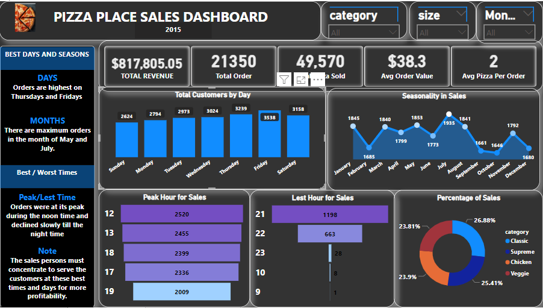

# my-capstone-project---PIZZA PLACE SALES ANALYSIS

## Introduction
This is an excel, SQL and power bi project based on a year's worth of sales from a **fictitious pizza place**, including the date and time of each order and the pizzas served, with additional details on the type, size, quantity, price, and ingredients. 
The project is to analyze and derive insights to answer vital business questions and help the store make data driven decisions.

**_Disclaimer_**:_All datasets and reports do not represent any company, institution or country. But just a dummy dataset to demonstrate my proficiency in advanced excel, PostgreSQL and power bi._ 

##  Problem Statement:
1. How many customers do we have each day? Are there any peak hours? 
2. How many pizzas are typically in an order? Do we have any bestsellers? 
3. How much money did we make this year? Can we identify any seasonality in the sales?
4. Are there any pizzas we should take of the menu, or any promotions we could leverage?

##  Skills / Concepts demonstrated:
1.	Excel skills: removing duplicates, removing outliers.
2.	PostgreSQL: creation of database, importing csv file, used functions like inner joins, group by, cast, order by, limit, case, etc.
3.	Power BI: DAX, measures, filter, transformation, modelling, tooltips, visualizations and reports. 

##  PostgreSQL Queries
'''sql

##  Modelling:
Automatically derived relationships are adjusted to set up a new relationship.

Auto model          |      Adjusted model
:------------------:|:--------------------:
 |                   |

The model is a star schema.
There are three-dimension table and one fact table and the tables are joined in a many-to-one relationships.

##  Visualization:
The report comprises of two pages:
•	Pizza sales dashboard
•	Best / worst sellers

###   You can interact with the report [here] (link to power bi service).

##  ANALYSIS of pizza sales Dashboard

##  Features
There are 5 kpi’s measuring the overall performance of the store and 3 slicers which are category, size and months as filters.

Best days and seasons
##  **_Days_**
Orders are highest on Thursdays, Fridays and Saturdays as weekends
##  **_Months_**
There are maximum orders in the month of July, May, March and January.
##  **_Best / worst time_**
Orders are at its peak during the noon time and declined slowly till the night time whereas we had little orders during the morning time. 

## Analysis of Best / worst sellers Dashboard

The thai chicken pizza gives the maximum revenue while the classic deluxe pizza contributes the highest to quantity. On the other hand, the brie carrie pizza accounts for the lowest in terms of revenue and total quantity.

##  Conclusion and Recommendations:
•	**To enhance revenue during months with lower sales, it is recommended to implement special sales initiatives, including discounts or other enticing offers. This suggestion stems from the observation that a substantial portion of sales occurred without the utilization of discounts or special offers. By strategically introducing more of these promotions during slower months, it is anticipated that revenue will experience a notable boost.**

•	**Considering the increased sales observed during weekends, with a decline from afternoon to nighttime, it is advisable for sales personnel to exert maximum effort in providing exemplary service to customers. During peak sales periods, it is essential to ensure an ample staff presence to facilitate prompt responses and meet customer needs effectively.**

•	**To sustain optimal sales for our best-selling pizzas, the marketing team is encouraged to conduct thorough research aimed at maintaining a competitive position. Simultaneously, extensive investigation should be undertaken for the underperforming pizzas. The team should assess whether removal from the menu or the implementation of strategic solutions is the most viable approach to address the challenges associated with these less popular pizza offerings.**

•	**A comprehensive review of the data collection process is warranted due to identified issues with data quality. Noteworthy concerns include the presence of numerous outliers in the quantity column and instances of misspelled words, necessitating manual resolution. It is proposed that a thorough examination of both data collection practices and data integrity be undertaken. This initiative aims to bolster the quantity and quality of available data, thereby enhancing our understanding of sales dynamics and customer behaviors.**

